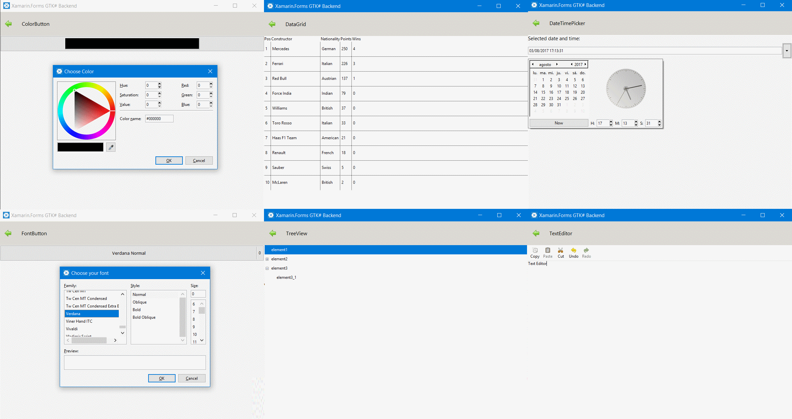

# Forms GTK Toolkit

The Forms GTK Toolkit is a collection of helper functions and custom controls for Xamarin.Forms GTK Backend.

## Features

### Controls

- [Calendar](docs/Controls/Calendar.md)
- [ColorButton](docs/Controls/ColorButton.md)
- [ColorPicker](docs/Controls/ColorPicker.md)
- [DataGrid](docs/Controls/DataGrid.md)
- [DateTimePicker](docs/Controls/DateTimePicker.md)
- [Expander](docs/Controls/Expander.md)
- [FileButton](docs/Controls/FileButton.md)
- [FontButton](docs/Controls/FontButton.md)
- [GridSplitter](docs/Controls/GridSplitter.md)
- [HyperLinkButton](docs/Controls/HyperLinkButton.md)
- [ImageCheckBox](docs/Controls/ImageCheckBox.md)
- [ScaleButton](docs/Controls/ScaleButton.md)
- [Separator](docs/Controls/Separator.md)
- [StatusBar](docs/Controls/StatusBar.md)
- [TextEditor](docs/Controls/TextEditor.md)
- [ToggleButton](docs/Controls/ToggleButton.md)
- [TreeView](docs/Controls/TreeView.md)

## Feedback 

Please use GitHub [issues](https://github.com/jsuarezruiz/FormsGtkToolkit/issues) for questions and comments.

## License

Code released under the [MIT license](https://opensource.org/licenses/MIT).