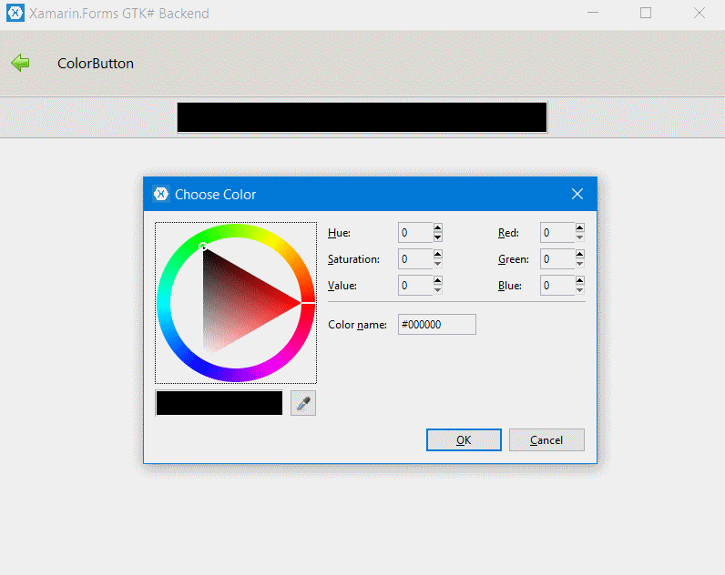

# ColorButton

 The **ColorButton** is a button which displays the currently selected **color** and allows to open a color selection dialog to change the color. 

## Properties

- **Color**: The selected color.
- **Title**: The title for the color selection dialog

## How to use?

    <controls:ColorPicker
          Color="Red" />