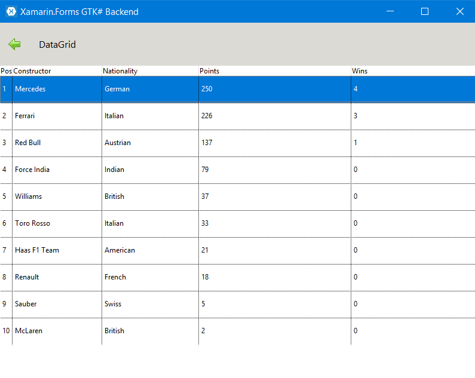

# DataGrid

Control for displaying **data in rows and columns**.

Features:

- Strong integration with the Xamarin.Forms binding mechanism.
- Configurable row height.
- Configurable column widths.
- Customizable colors.

